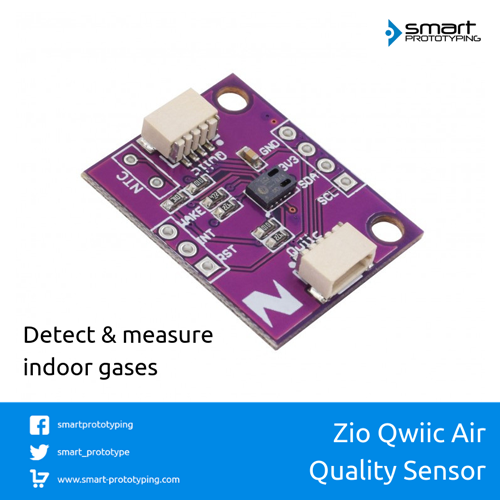

# Zio Qwiic Air Quality Sensor (CCS811)

> This product can be available for purchase [here](https://www.smart-prototyping.com/Zio-Qwiic-Air-Quality-Sensor-CCS811).

#### Description

The Zio Qwiic Air Quality features a CCS811 sensor from AMS, it’s a very small size gas sensor and it can detect a wide range of Volatile Organic Compounds (VOCs) for indoor air quality monitoring. 
 
This sensor can measure

* eCO2 (equivalent calculated carbon-dioxide), from 400 to 8192 ppm (parts per million)
* VOC (Total Volatile Organic Compound, from 0 to 1187 ppb (parts per billion)
* Ambient temperature (optional), it can help compensate the readings. 

Likewise all VOC/ gas sensors, the sensor has to be calibrated before use. Per AMS recommendation, the sensor has to run 48 hours the first time of use. Then 20 minutes on preferred mode every time it is used.

The CCS811 has a configurable interrupt pin, it can fire when a conversion is ready as well as when a reading crosses a user-settable threshold. It also has ability to take measurements supporting multiple drive modes to take measurements every 250 milliseconds, 1, 10 and 60 seconds.

Like other Zio Qwiic boards, it incorporates the Qwiic connector for it’s convenient and practical setup. Although, we also incorporated the breakout pins on the board to be able to use it on a breadboard.

#### Specification

* Operation Voltage: 3.3V
* Interface: I2C (address 0x5A and 0x5B)
* Dimensions: 25.5 x 26.6mm
* Weight:1.7g

#### Links

* [PCB Source File and Schematic](https://github.com/ZIOCC/Zio-Qwiic-Air-Quality-Sensor-CCS811)
* [CCS811 Datasheet](https://ams.com/documents/20143/36005/CCS811_DS000459_6-00.pdf/)
* [Sparkfun CCS811 Library](https://github.com/sparkfun/SparkFun_CCS811_Arduino_Library)
* [Adafruit CCS811 Library](https://github.com/adafruit/Adafruit_CCS811)

> ###### About Zio
> Zio is a new line of open sourced, compact, and grid layout boards, fully integrated for Arduino and Qwiic ecosystem. Designed ideally for wearables, robotics, small-space limitations or other on the go projects. Check out other awesome Zio products [here](https://www.smart-prototyping.com/Zio).
